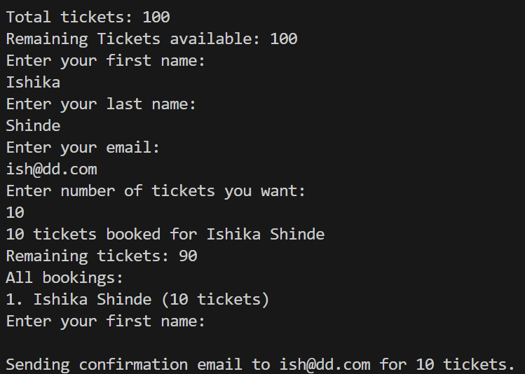

# miniBookingApp

A simple and interactive Go CLI application to simulate a basic ticket booking system. This mini project demonstrates concepts like user input, validation, concurrency, and modular design in Golang.

✨ Features  
➕ Book tickets using user input  
✅ Validate first name, last name, email, and ticket number  
📤 Simulated confirmation email (console output)  
🔁 Continuous input until tickets run out  
📃 Show list of all bookings  
⚙️ Uses goroutines and WaitGroups

🛠 Technologies Used  
Go (Golang)  
VS Code  
Go Modules & Packages  

📂 Project Structure  
main.go – Entry point of the program  
helper/input.go – Handles input and validation  
model/user.go – Stores user data  
services/booking.go – Booking logic  
utils/mailer.go – Simulated confirmation logic  

🚀 How to Run  
Clone the repository:  
git clone https://github.com/ShindeIshika/miniBookingApp.git  

Navigate to the project directory:  
cd miniBookingApp  

Run the application:  
go run .  

📸 Sample Output  

📌 License  
This project is created for educational purposes and learning Golang CLI applications.

🧠 Author  
Created by Ishika Shinde as part of a Golang mini project.
